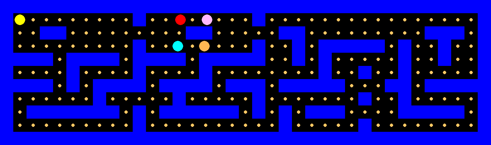

# BeliefRL-Grid
A grid-based environment where Pac-Man learns to act by modeling the beliefs of ghost agents. Built for research in belief-aware policies, theory of mind, and multi-agent RL.

## Example Gameplay

Check out a sample run:



## Installation

```bash
git clone https://github.com/MorningStarTM/BeliefRL-Grid.git
cd pac_man
pip install -e . 

```

## Usage
```bash 
from pacman_env.pac_gym import PacManEnv

env = PacManEnv()
obs = env.reset()
done = False
while not done:
    action = env.action_space.sample()
    obs, reward, done, info = env.step(action)
    env.render()
env.close()
```

## Register The Env for Gymnasium (Optional)
Add a line in your main `__init__.py`:
```python
import gymnasium as gym
from .pac_gym import PacManEnv

gym.envs.registration.register(
    id="ToMPacMan-v0",
    entry_point="pacman_env.pac_gym:PacManEnv",
)


env = gym.make("ToMPacMan-v0")
```

## Train PPO Agent
 1. Define your config file inside of model_training.py
 2. Run training file
    ```bash
    python model_training.py
    ```
 3. Model weight will be saved in Models folder
 4. Run test.py to test Agent

 
